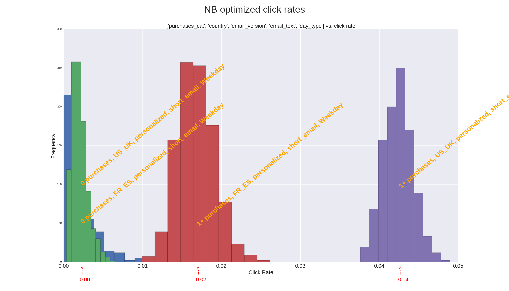
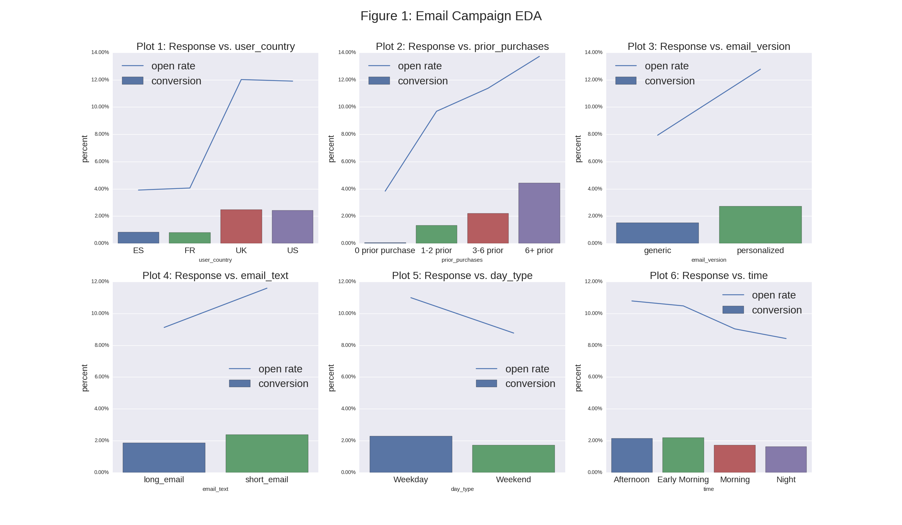

#Email Campaign Analysis

##Q1
*What percentage of users opened the email and what percentage clicked on the link within the email?*

    open rate 10.35%
    click rate 20.48%
    click sent rate 2.12%

##Q2
*The VP of marketing thinks that it is stupid to send emails to a random subset and in a
random way. Based on all the information you have about the emails that were sent, can
you build a model to optimize in future email campaigns to maximize the probability of
users clicking on the link inside the email?*

>Since most of the classifications were negative, various models including logistic regression, random forest, and naive bayes classifier would predict that no observations would be positive and still obtain a 97% accuracy rate.  
By reducing the threshold probabilities for a positive result, this would increase the number of true positive predictions but at the cost of severely increasing false positives.

>Instead of these models, I used a variation of naive bayes a/b test to determine the probabilities that conversion rates between various scenarios were different.
>The method I used was to segment the emails into combinations of categories to determine which combinations yielded the highest conversion
rates.  I then ran a simulation of conversion rates from a parameterized beta distribution.

##Q3
*By how much do you think your model would improve click through rate ( defined as # of
users who click on the link / total users who received the email). How would you test
that?*

>I could improve the click rate to about 7.3% from 2.1% by targeting users with the following characteristics:

>* US or UK customer
>* greater than 6+ prior purchases
>* personalized and short email
>* weekday email delivery

>I would test the model by sending emails to the above customers with a prior probability guess of 7.3%.  Over time I would check to see that the calculated prior converges or stabilizes at 7.3%.  This would indicate that my estimated conversion rate is correct.

>Although this would achieve the highest conversion rate, this would be a very narrow subsegment of customers to focus on.

##Q4
*Did you find any interesting pattern on how the email campaign performed for different
segments of users? Explain.*

>Yes, I found that French and Spanish users had much lower email open rates than US or UK customers.  See plot 1 below.

>There may be a cultural difference in terms of email privacy that may reflect this.  Also,  users with higher prior purchases had much better response rates probably reflecting ongoing engagement with the web platform.  The timing of email deliveries matters somewhat.  Receptivity was better on weekdays rather than weekends.  In addition, emails sent in the afternoons or early mornings were more effective than at night or in the later morning.      

>Not suprisingly, personalized short emails were more effective the long generic ones.

>In order to obtain more Continental European customers it may be necessary to reach out to these customers through different channels, such as commercials, radio ads, news ads, etc.

##Appendix:

Naive bayes simulated distributions

